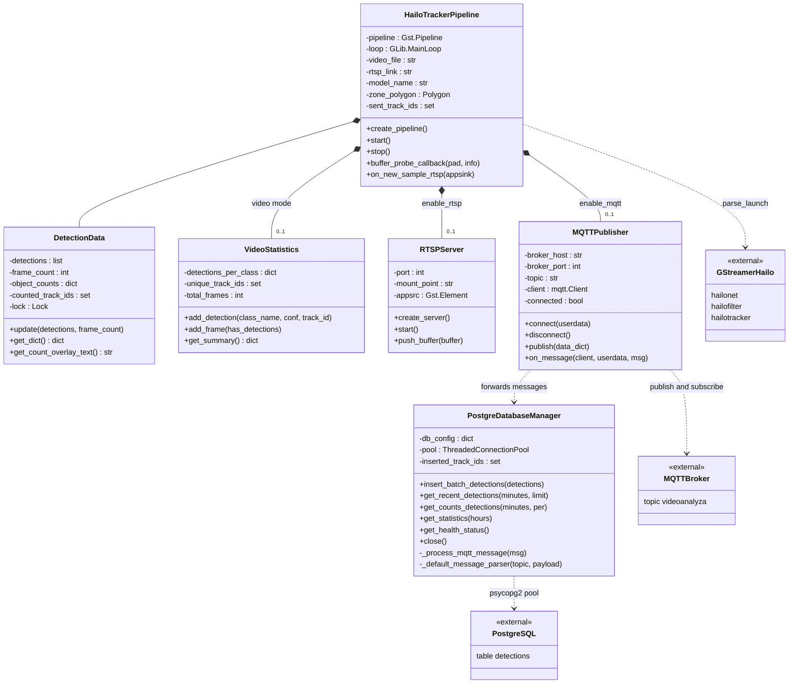
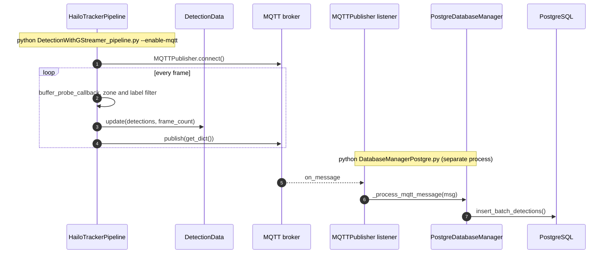
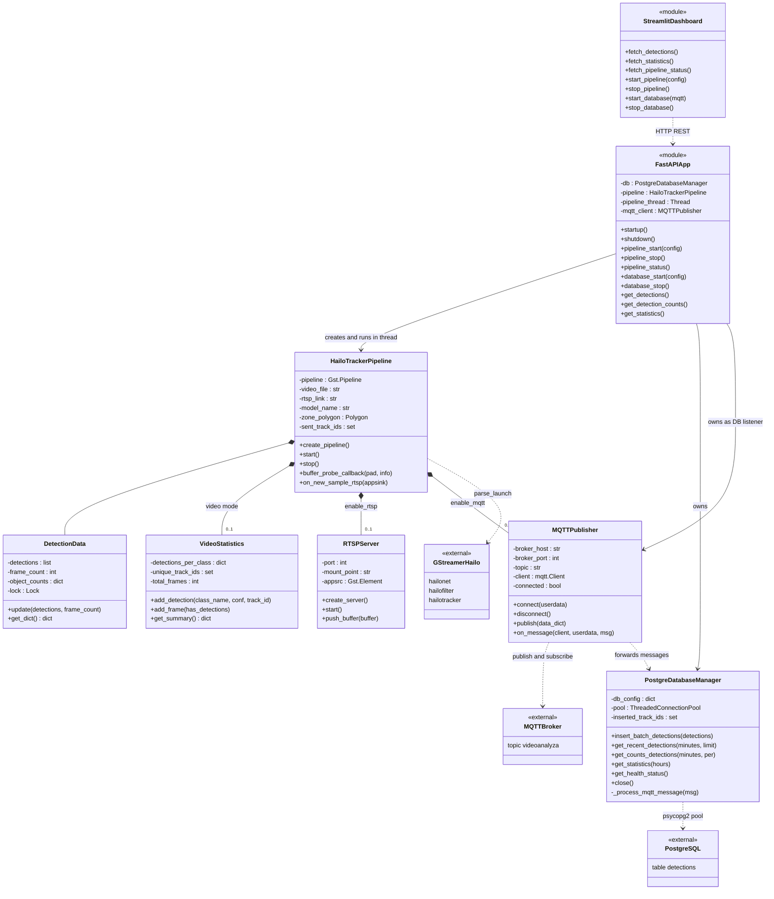
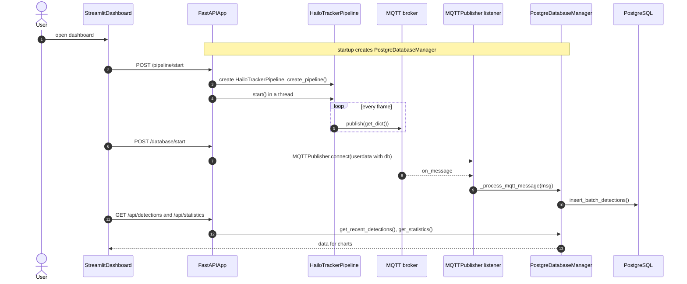

# Traffic Detection System – UML (thesis version)

## Class diagram

```mermaid
classDiagram
direction TB

class HailoTrackerPipeline {
    -pipeline : Gst.Pipeline
    -loop : GLib.MainLoop
    -video_file : str
    -rtsp_link : str
    -model_name : str
    -zone_polygon : Polygon
    -sent_track_ids : set
    +create_pipeline()
    +start()
    +stop()
    +buffer_probe_callback(pad, info)
    +on_new_sample_rtsp(appsink)
}

class DetectionData {
    -detections : list
    -frame_count : int
    -object_counts : dict
    -counted_track_ids : set
    -lock : Lock
    +update(detections, frame_count)
    +get_dict() dict
    +get_count_overlay_text() str
}

class VideoStatistics {
    -detections_per_class : dict
    -unique_track_ids : set
    -total_frames : int
    +add_detection(class_name, conf, track_id)
    +add_frame(has_detections)
    +get_summary() dict
}

class RTSPServer {
    -port : int
    -mount_point : str
    -appsrc : Gst.Element
    +create_server()
    +start()
    +push_buffer(buffer)
}

class MQTTPublisher {
    -broker_host : str
    -broker_port : int
    -topic : str
    -client : mqtt.Client
    -connected : bool
    +connect(userdata)
    +disconnect()
    +publish(data_dict)
    +on_message(client, userdata, msg)
}

class PostgreDatabaseManager {
    -db_config : dict
    -pool : ThreadedConnectionPool
    -inserted_track_ids : set
    +insert_batch_detections(detections)
    +get_recent_detections(minutes, limit)
    +get_counts_detections(minutes, per)
    +get_statistics(hours)
    +get_health_status()
    +close()
    -_process_mqtt_message(msg)
    -_default_message_parser(topic, payload)
}

class GStreamerHailo {
    <<external>>
    hailonet
    hailofilter
    hailotracker
}
class MQTTBroker {
    <<external>>
    topic videoanalyza
}
class PostgreSQL {
    <<external>>
    table detections
}

HailoTrackerPipeline *-- DetectionData
HailoTrackerPipeline *-- "0..1" VideoStatistics : video mode
HailoTrackerPipeline *-- "0..1" RTSPServer : enable_rtsp
HailoTrackerPipeline *-- "0..1" MQTTPublisher : enable_mqtt
HailoTrackerPipeline ..> GStreamerHailo : parse_launch

MQTTPublisher ..> MQTTBroker : publish and subscribe
MQTTPublisher ..> PostgreDatabaseManager : forwards messages
PostgreDatabaseManager ..> PostgreSQL : psycopg2 pool
```

## Runtime flow

```mermaid
sequenceDiagram
autonumber
participant P as HailoTrackerPipeline
participant D as DetectionData
participant M as MQTT broker
participant L as MQTTPublisher listener
participant DB as PostgreDatabaseManager
participant PG as PostgreSQL

Note over P: python DetectionWithGStreamer_pipeline.py --enable-mqtt
P->>M: MQTTPublisher.connect()
loop every frame
    P->>P: buffer_probe_callback, zone and label filter
    P->>D: update(detections, frame_count)
    P->>M: publish(get_dict())
end
Note over L,DB: python DatabaseManagerPostgre.py (separate process)
M-->>L: on_message
L->>DB: _process_mqtt_message(msg)
DB->>PG: insert_batch_detections()
```

---

# Extended version (with FastAPI and Streamlit dashboard)

## Class diagram

```mermaid
classDiagram
direction TB

class StreamlitDashboard {
    <<module>>
    +fetch_detections()
    +fetch_statistics()
    +fetch_pipeline_status()
    +start_pipeline(config)
    +stop_pipeline()
    +start_database(mqtt)
    +stop_database()
}

class FastAPIApp {
    <<module>>
    -db : PostgreDatabaseManager
    -pipeline : HailoTrackerPipeline
    -pipeline_thread : Thread
    -mqtt_client : MQTTPublisher
    +startup()
    +shutdown()
    +pipeline_start(config)
    +pipeline_stop()
    +pipeline_status()
    +database_start(config)
    +database_stop()
    +get_detections()
    +get_detection_counts()
    +get_statistics()
}

class HailoTrackerPipeline {
    -pipeline : Gst.Pipeline
    -video_file : str
    -rtsp_link : str
    -model_name : str
    -zone_polygon : Polygon
    -sent_track_ids : set
    +create_pipeline()
    +start()
    +stop()
    +buffer_probe_callback(pad, info)
    +on_new_sample_rtsp(appsink)
}

class DetectionData {
    -detections : list
    -frame_count : int
    -object_counts : dict
    -lock : Lock
    +update(detections, frame_count)
    +get_dict() dict
}

class VideoStatistics {
    -detections_per_class : dict
    -unique_track_ids : set
    -total_frames : int
    +add_detection(class_name, conf, track_id)
    +add_frame(has_detections)
    +get_summary() dict
}

class RTSPServer {
    -port : int
    -mount_point : str
    -appsrc : Gst.Element
    +create_server()
    +start()
    +push_buffer(buffer)
}

class MQTTPublisher {
    -broker_host : str
    -broker_port : int
    -topic : str
    -client : mqtt.Client
    -connected : bool
    +connect(userdata)
    +disconnect()
    +publish(data_dict)
    +on_message(client, userdata, msg)
}

class PostgreDatabaseManager {
    -db_config : dict
    -pool : ThreadedConnectionPool
    -inserted_track_ids : set
    +insert_batch_detections(detections)
    +get_recent_detections(minutes, limit)
    +get_counts_detections(minutes, per)
    +get_statistics(hours)
    +get_health_status()
    +close()
    -_process_mqtt_message(msg)
}

class GStreamerHailo {
    <<external>>
    hailonet
    hailofilter
    hailotracker
}
class MQTTBroker {
    <<external>>
    topic videoanalyza
}
class PostgreSQL {
    <<external>>
    table detections
}

StreamlitDashboard ..> FastAPIApp : HTTP REST
FastAPIApp --> HailoTrackerPipeline : creates and runs in thread
FastAPIApp --> PostgreDatabaseManager : owns
FastAPIApp --> MQTTPublisher : owns as DB listener

HailoTrackerPipeline *-- DetectionData
HailoTrackerPipeline *-- "0..1" VideoStatistics : video mode
HailoTrackerPipeline *-- "0..1" RTSPServer : enable_rtsp
HailoTrackerPipeline *-- "0..1" MQTTPublisher : enable_mqtt
HailoTrackerPipeline ..> GStreamerHailo : parse_launch

MQTTPublisher ..> MQTTBroker : publish and subscribe
MQTTPublisher ..> PostgreDatabaseManager : forwards messages
PostgreDatabaseManager ..> PostgreSQL : psycopg2 pool
```

## Runtime flow

```mermaid
sequenceDiagram
autonumber
actor User
participant UI as StreamlitDashboard
participant API as FastAPIApp
participant P as HailoTrackerPipeline
participant M as MQTT broker
participant L as MQTTPublisher listener
participant DB as PostgreDatabaseManager
participant PG as PostgreSQL

User->>UI: open dashboard
Note over API,DB: startup creates PostgreDatabaseManager
UI->>API: POST /pipeline/start
API->>P: create HailoTrackerPipeline, create_pipeline()
API->>P: start() in a thread
loop every frame
    P->>M: publish(get_dict())
end
UI->>API: POST /database/start
API->>L: MQTTPublisher.connect(userdata with db)
M-->>L: on_message
L->>DB: _process_mqtt_message(msg)
DB->>PG: insert_batch_detections()
UI->>API: GET /api/detections and /api/statistics
API->>DB: get_recent_detections(), get_statistics()
DB-->>UI: data for charts
```